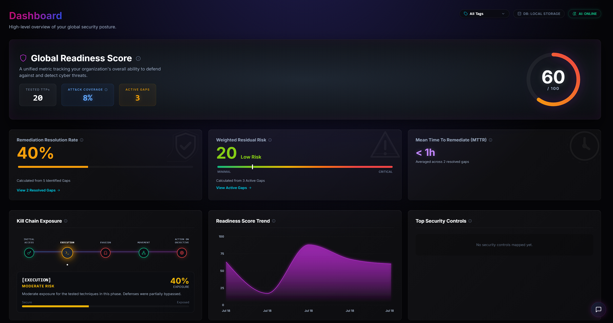
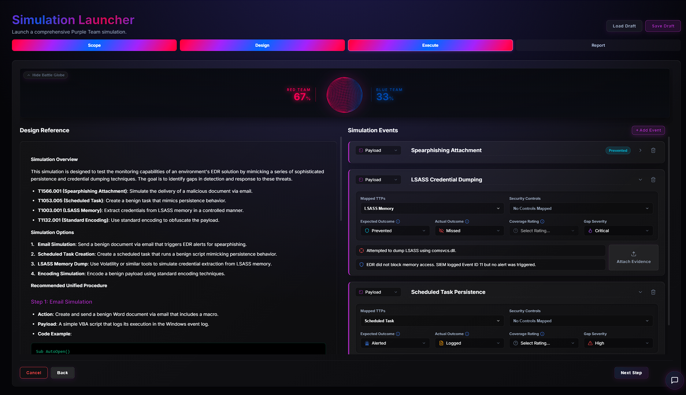
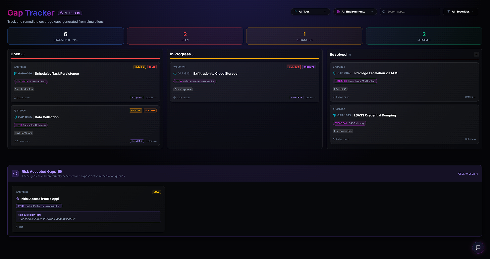
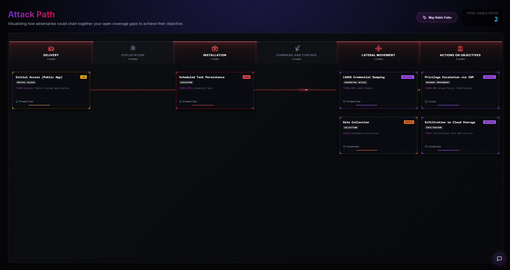

<div align="center">
  <br />
  
  <h1>Control Drift</h1>
  <p><strong>A modern platform for empowering cybersecurity professionals to actively assess security control effectiveness, measure defense capability, and increase readiness against real-world cyber threats.</strong></p>

  <p>
    <a href="#the-problem-security-control-drift">The Problem</a> •
    <a href="#why-control-drift">Why Control Drift?</a> •
    <a href="#features">Features</a> •
    <a href="#quick-start">Quick Start</a>
  </p>
</div>

<hr />

## The Problem: Security Control Drift

"Control Drift" occurs when the *expectation* of a security control's effectiveness does not meet the *reality* of its performance. This can happen when an established control (such as an EDR/AV policy, firewall rule, or endpoint configuration) silently degrades or breaks over time due to environment changes, misconfigurations, or software updates. Apart from detecting security control decay, Control Drift is equally about proactively identifying inherent security shortcomings and evaluating where current controls fundamentally fail to meet defensive expectations.

Traditional Breach and Attack Simulation (BAS) tools and purple-teaming platforms are often weighed down by massive infrastructure requirements, clunky user interfaces, and bloated feature sets that make discovering and tracking these gaps a chore, rather than an engaging experience.

**Control Drift is built differently.** It's designed to enable defenders to actively challenge their security stack, discover hidden gaps, and learn more about adversary simulation through practical application.

## Why Control Drift?

While other purple-teaming frameworks and posture management tools exist, Control Drift was engineered to solve the pain points inherent in legacy and SaaS platforms:

### 1. Zero-Infrastructure Start
Unlike heavy, legacy platforms that require multi-container Docker stacks, databases, and message brokers just to boot up, **Control Drift can run entirely in your browser.** By utilizing IndexedDB for a local-first experience, you can clone the repository, run `npm run dev`, and start logging gaps immediately. An enterprise setup can be deployed by attaching a Supabase or REST API backend with zero code changes.

### 2. Next-Gen UX/UI
Security analysts deserve tools that feel as good as they work. Control Drift escapes the era of exhausting enterprise data tables. It features a premium, dark-mode glassmorphic interface, dynamic micro-animations, and intuitive workflows that significantly lower the barrier to entry for analysts beginning their Purple Teaming / gap analysis journey.

### 3. AI-Augmented Workflows
Control Drift includes plug-and-play AI-powered features such as a context-aware chatbot, TTP auto-mapping, simulation strategy generation, executive report generation, and payload / detection rule generation. Simply configure an AI integration within the application settings or via an external proxy.

### 4. Event-Driven Posture Modeling
Many platforms treat technique execution as a rigid 1:1 relationship with a raw outcome. Control Drift utilizes a flexible **event system**. An activity occurring in a simulation is considered an event, which can be tied to one or multiple MITRE TTPs simultaneously. By tracking different procedural variations and how they affect the broader event outcome, Control Drift paints a significantly more accurate picture of your true defensive posture. Furthermore, it supports **per-event coverage ratings**—recognizing that a raw outcome like "Alerted" might be considered optimal coverage in one scenario but only partial coverage in another, depending on the specific environmental context and whether that outcome is the most realistically achievable result for that event type.

### 5. Analyst Empowerment over Automation
While many commercial solutions attempt to completely automate the testing lifecycle in a "black box" manner, Control Drift is designed to empower human analysts. It encourages defenders to get hands-on, practically test against their own unique environments, and build deep intuition about adversary tradecraft rather than relying entirely on obscure, automated 
clicks.

---

## Features

- **Security Operations Dashboard**: Track real-time metrics including Kill Chain Exposure, Top Security Controls, and Remediation Burndown.
  <br/>
  

- **MITRE ATT&CK Heatmap & Battle Globe**: Fully interactive 3D globe providing a visual representation of your security posture across the MITRE ATT&CK framework, dynamically updated based on simulation outcomes.
  <br/>
  

- **Simulation Management**: Plan, execute, and log threat simulations in a highly streamlined manner using the intuitive 4-step Simulation Launcher.
  <br/>
  

- **Code Studio**: An integrated, AI-assisted IDE for writing, editing, and managing detection rules (Sigma, YARA, Splunk SPL, Azure KQL) and emulation payloads directly in the browser.

- **End-to-end Gap Tracking & Remediation**: Track and prioritize gap remediation across your environment using the built-in Gap Tracker. Successfully resolved gaps will positively reflect throughout Control Drift's metrics.
  <br/>
  

- **Attack Path Mapping**: Visualize attack paths and choke points across your environment. Leverage your AI integration to automatically map viable attack paths based on your active gaps.
  <br/>
  
- **Integrated AI**: Plug-and-play AI integration to enhance workflows and introduce next generation AI-powered features.
- **Flexible Data Adapters**: Start with `localStorage`/`IndexedDB` for quick testing, then migrate to a backend database (`Supabase`, `Firebase`) or a custom `REST API` when you're ready to scale.

---

## Quick Start

Get up and running locally in less than 60 seconds.

### Prerequisites
- Node.js (v18 or higher)
- npm or yarn

### Installation

1. **Clone the repository:**
   ```bash
   git clone https://github.com/Control-Drift/Control-Drift.git
   cd control-drift
   ```

2. **Install dependencies:**
   ```bash
   npm install
   ```

3. **Start the development server:**
   ```bash
   npm run dev
   ```

4. **Open your browser:** Navigate to `http://localhost:5173`. You are now running Control Drift entirely in your browser using the local database adapter!

### Connecting a Remote Database (Optional)

For instructions on deploying a self-hosted backend, AI proxy, and the frontend on a single server for your enterprise, please see our **[Enterprise Deployment Guide](docs/deployment.md)**.

---

## Contributing

We welcome contributions from the community! Whether it's adding new database adapters, refining the UI, or extending the MITRE mappings, please feel free to submit a Pull Request.

## License

This project is licensed under the Apache 2.0 License. See the [LICENSE](LICENSE) file for details.
